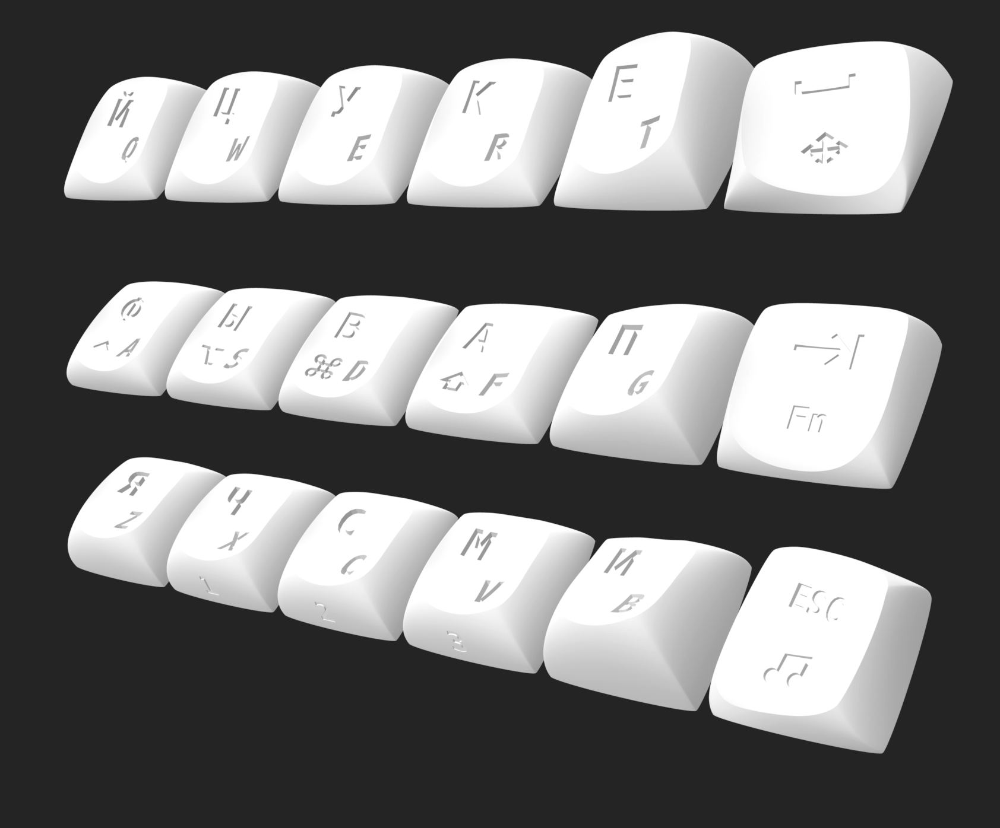
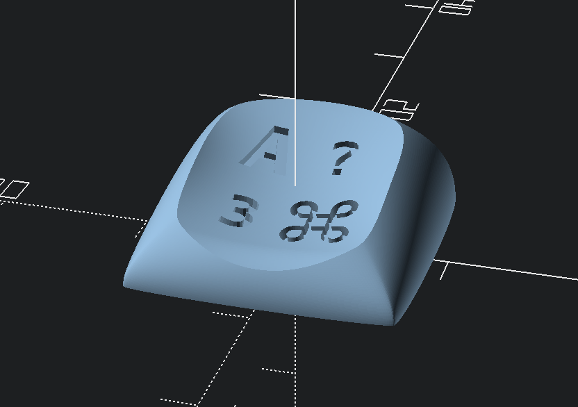
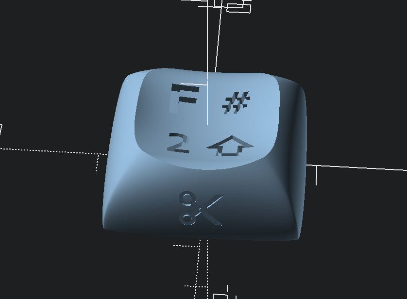
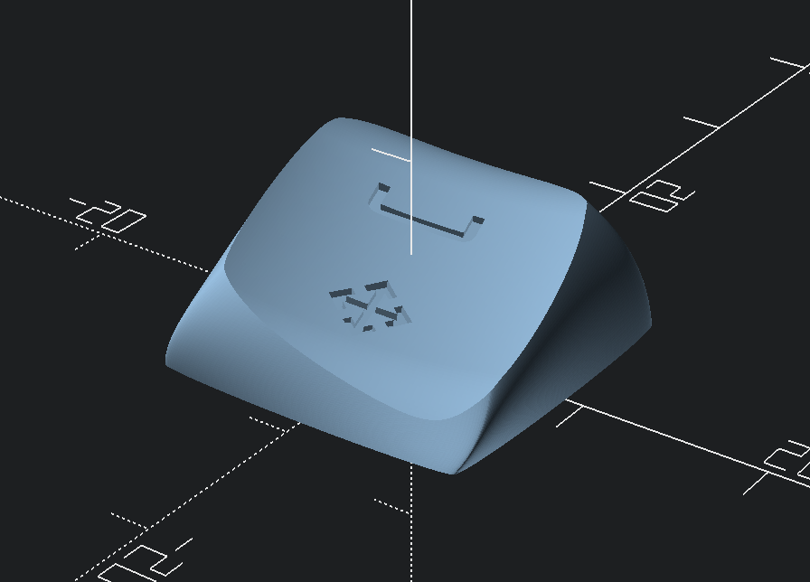

# DES keycaps for MX low profile switches with legends

Based on honourable [@pseudoku](https://github.com/pseudoku/)'s [DES](https://github.com/pseudoku/PseudoMakeMeKeyCapProfiles)

Contains 3 rows (R2, R3, R4) and 3 keys for thumbs.
Row keys has tilted version for inner index column.



### Fits switches:
- Gateron low profile V1 and V2 (KS-27 and KS-33)
- Nuphy low profile
- Keychron low profile optical
- Kailh Choc V2

## OpenSCAD sources

Source code is in `openscad` directory.

`key.scad` generates single keycap.

`generator.scad` contains legends presets for both halfs.

`make_left.scad` and `make_right.scad` generates keycaps in one STL for selected half. 


## How to
Before you start make sure OpenSCAD is up to date.

### Render one keycap
* open `key.scad` in OpenScad
* select keycap you want to render by changing KeyID in `keycap` call
* press F5 to review
* press F6 to render
* press F7 to export as STL

### Legends
If you want to render keycap without legend just set `Legends` parameter to `false`.

All matrix keycaps has defined positions for 2 legends:
1. In top left corner with fontsize 4
2. In bottom right corner with fontsize 3.5

All matrix keycaps except inner index column has 2 extra positions:
3. In bottom left corner with fontsize 3
4. In top right corner with fontsize 3


Bottom row caps has one extra position on bottom cap side.


Thumbs keycaps has 2 legend positions:
1. On top with fontsize 3
2. On bottom with fontsize 2.5


To render legends you have to pass them as array in `Legend` parameter. 
```
keycap(
  keyID  = 0, //set keycap
  cutLen = 0, //Don't change. for chopped caps
  Stem   = true, //turn on shell and stems
  Dish   = true, //turn on dish cut
  Stab   = 0, 
  visualizeDish = false, // turn on debug visual of Dish 
  crossSection  = false, // center cut to check internal
  homeDot = false, //turn on homedots
  Legends = ["A",  "command.svg", "3", "!"]
);

```

Each element of legends array may be a symbol, SVG filename or array. Use array as element if you need to specify font size for the legend.
```Legends = ["A", ["shift.svg", 5], ["?", 2.5]]```
You may use empty string for any element to reach next.
```Legends = ["A", "", "", ["?", 2.5]]```


SVG incons are stored in `symbols` directory. If you want to add icons do check paths in svg files. OpenSCAD can't close paths correctly so in some icons you need to do it manually.

Default font for legends is Menlo. It's shipped with MacOS since version 10.13. 

### Render whole half
To render all keycaps for keyboard half in one STL select a preset from `generator.scad` and put it to make-file `make_left.scad` or `make_right.scad`. For examle, to render caps for left half with English Qwerty legends:
```
use <generator.scad>

// Generates all keycaps for left part
generate_part(leftQuerty);
```

Generated STL is useful for resin print. Default parameters allows to print generated STL even on small printers like Elegoo Mars or Anycubic Photon Mono. 

You can change horizontal spacing with `horizontalPitch` variable.
Vertical spacing and X-axis rotation are set in `rows` array.

### Headless rendering
Rendering all keycaps may take a few hours. So a reasonable solution is to render them from command line.

Make sure you put correct preset to make-file before start. Then run rendering in terminal.

```
openscad -o left.stl make_left.scad
```

On Mac you can use full path to OpenSCAD:
```
/Applications/OpenSCAD.app/Contents/MacOS/openscad -o left.stl make_left.scad
```
